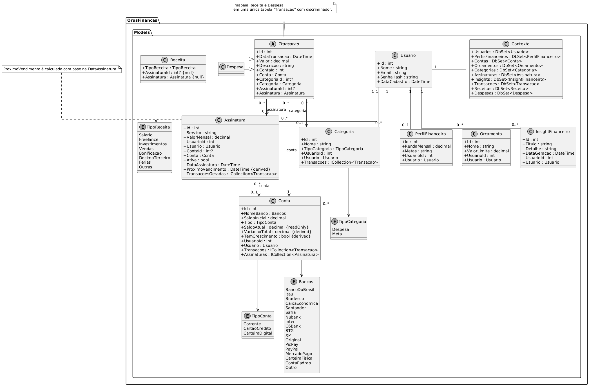

# 💰 Orus Finanças - Sistema de Controle Financeiro Pessoal

Sistema completo para gestão financeira pessoal desenvolvido em ASP.NET Core 8 com Entity Framework Core para a matéria de Tópicos 3.

-----

## ✨ Funcionalidades Implementadas

### 🔐 Autenticação e Usuários

  - [x] Cadastro de novos usuários com hash de senha seguro (BCrypt)
  - [x] Login com autenticação por cookies
  - [x] Logout e gerenciamento de sessões
  - [x] Sistema de autorização para proteger rotas

### 💳 Gestão de Contas

  - [x] Criar contas (Corrente, Cartão de Crédito, Carteira Digital)
  - [x] Suporte a diferentes bancos (Nubank, Inter, BB, Itaú, etc.)
  - [x] Cálculo automático de saldo atual

### 🏷️ Gestão de Categorias

  - [x] Criar e gerenciar categorias personalizadas
  - [x] Associar categorias às transações

### 📝 Gestão de Transações

  - [x] Lançamento de Receitas e Despesas
  - [x] Associação com contas e categorias
  - [x] Filtros por data, conta e categoria

  


### 🔄 Gestão de Assinaturas (Recorrências)

  - [x] Cadastro de serviços recorrentes
  - [x] Controle de assinaturas ativas/inativas
  - [x] Cálculo de próximos vencimentos

### 📊 Orçamentos (Budgets)

  - [x] Criação de orçamentos mensais por categoria
  - [x] Monitoramento de gastos vs orçamento
  - [x] Status visual dos orçamentos

### 🖥️ Dashboard Completo

  - [x] Resumo financeiro (Receitas vs Despesas)
  - [x] Exibição das maiores despesas
  - [x] Status dos orçamentos com barras de progresso
  - [x] Próximas assinaturas a vencer

### 📈 Relatórios

  - [x] Extrato financeiro com filtros
  - [x] Gráfico de gastos por categoria (Chart.js)
  - [x] Balanço mensal
  - [x] Relatório de assinaturas

-----

## 🧭 Modelagem

Visão geral das entidades principais e seus relacionamentos dentro do sistema.



-----

## 🚀 Como executar o projeto

### Pré-requisitos

  - .NET 8.0 SDK
  - SQL Server ou SQL Server LocalDB

### Passos para execução

1.  **Clone o repositório**

    ```bash
    git clone https://github.com/italobeckman/OrusFinancas.git
    cd OrusFinancas
    ```

2.  **Configure a string de conexão**

      - Abra o arquivo `Program.cs`
      - Verifique se a string de conexão está correta:
        ```csharp
        "Server=(localdb)\\mssqllocaldb;Database=OrusFinancas;Trusted_Connection=True;"
        ```

3.  **Execute as migrações**

    ```bash
    dotnet ef database update
    ```

4.  **Execute o projeto**

    ```bash
    dotnet run
    ```

5.  **Acesse no navegador**

    ```
    https://localhost:5277
    ```

-----

## 📖 Como usar o sistema

### Primeiro acesso

1.  Clique em **"Cadastrar"** e crie sua conta
2.  Faça login com suas credenciais
3.  No **Dashboard**, você verá as principais informações

### Configuração inicial

1.  **Crie suas contas** (Menu Financeiro \> Contas)

      - Adicione suas contas correntes, cartões, etc.
      - Defina o saldo inicial de cada conta

2.  **Configure categorias** (Menu Financeiro \> Categorias)

      - Crie categorias como "Alimentação", "Transporte", etc.
      - O sistema já cria algumas categorias padrão

3.  **Defina orçamentos** (Menu Planejamento \> Orçamentos)

      - Crie orçamentos mensais para cada categoria
      - O sistema criará orçamentos padrão se desejar

### Uso diário

1.  **Lance suas transações** (Menu Financeiro \> Transações)

      - Adicione receitas e despesas conforme ocorrem
      - Associe cada transação a uma conta e categoria

2.  **Monitore no Dashboard**

      - Veja seu saldo atual
      - Acompanhe o status dos orçamentos
      - Leia o insight financeiro do dia

3.  **Configure assinaturas** (Menu Planejamento \> Assinaturas)

      - Adicione Netflix, Spotify, etc.
      - O sistema gerará as despesas automaticamente

### Análise e relatórios

1.  **Relatórios** (Menu Relatórios)

      - Extrato detalhado com filtros
      - Gráficos de gastos por categoria
      - Balanço mensal completo
      - Análise de assinaturas

2.  **Insights** (Menu Insights)

      - Veja sugestões personalizadas
      - Histórico de insights anteriores

-----

## 💻 Tecnologias utilizadas

  - **Framework**: ASP.NET Core 8.0
  - **ORM**: Entity Framework Core
  - **Banco de dados**: SQL Server
  - **Autenticação**: Cookie Authentication
  - **Hash de senha**: BCrypt.NET
  - **Frontend**: Bootstrap 5 + Bootstrap Icons
  - **Gráficos**: Chart.js
  - **Padrão**: MVC com Razor Pages

-----

## 🔒 Segurança

  - Senhas são criptografadas com BCrypt
  - Autenticação por cookies seguros
  - Validação de autorização em todos os controllers
  - Proteção CSRF em formulários
  - Validação de entrada de dados

-----

## ⚠️ Problemas

  - Se encontrar problemas com migrações, delete o banco e execute `dotnet ef database update` novamente
  - Certifique-se de que o SQL Server está instalado e funcionando

-----